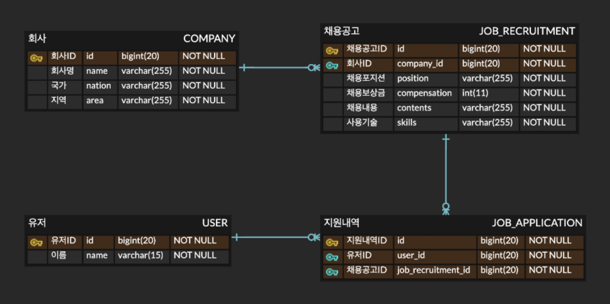

## 기술 정보
- 언어 및 프레임워크: Node.js & NestJS
- ORM: TypeORM
- RDBMS: PostgreSQL

## 관계형 데이터 모델링



- ERD Cloud Link: https://www.erdcloud.com/d/MEq9L3KrcRKmm2tBH

## 환경 설정

- 의존성 패키지 설치
```bash
$ npm install
```

- .env 파일 설정 (.env.example 참고)
```.env
DB_HOST=
DB_PORT=
DB_USER=
DB_PASS=
DB_NAME=
```

- PostgreSQL 설치 및 실행

위 환경변수와 맞춰서 데이터베이스 설정


## 실행 방법

- 서버 실행
```bash
$ npm run start
```


- 개발 모드로 실행
```bash
$ npm run start:dev
```

## 요구 사항 분석

## 구현 과정
